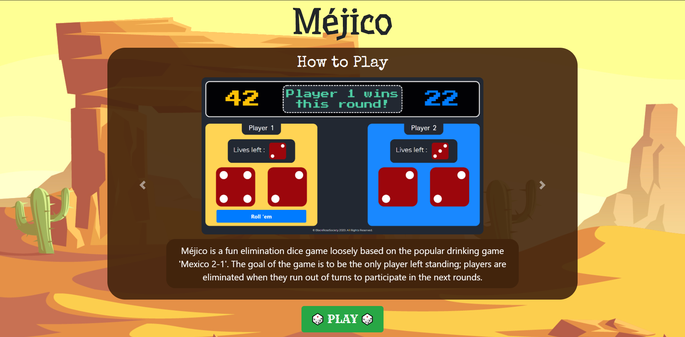
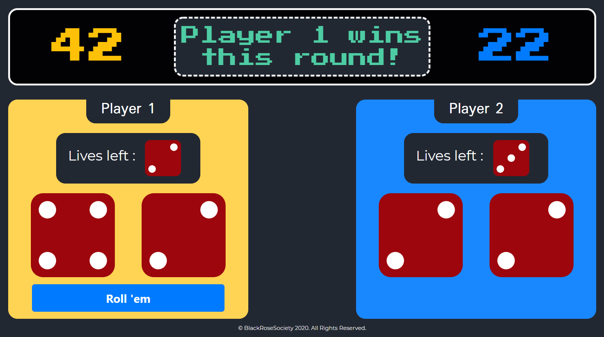

# Méjico
A fun dice game (inspired from the popular drinking game Mexico 21) built using vanilla JS.
---

Méjico is an elimination dice game that requires 2 dice for rolling and one additional dice for keeping track of each player's lives in the game. The goal of the game is to be the only player left standing. 

* At the beginning of the game, each player starts out with 6 lives. 
* Two dice are used by each player, and on every roll their separate numerical values are combined to form a two-digit number. 
* The player with the lowest roll in that turn loses a life. 
* The game is continued until one of the players loses all 6 lives and is eliminated. 
* The last one standing is the winner.
---

You can see Méjico in action by playing the game here -> [Play Méjico](https://soumik-dhar.github.io/Mejico/)

P.S.: The dice rolls are generated pseudo-randomly and the logic behind the game is coded in vanilla JS (without any added frameworks).
